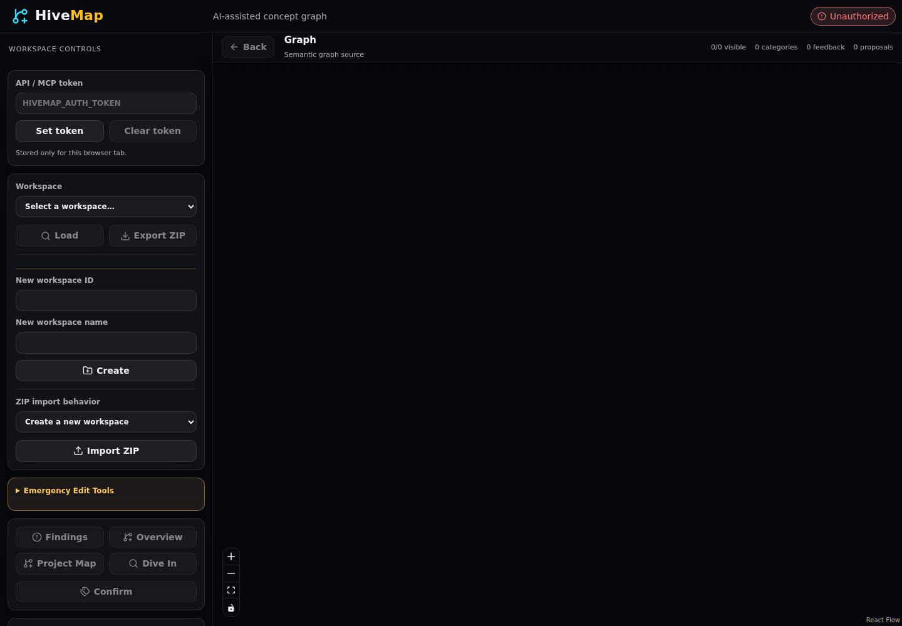
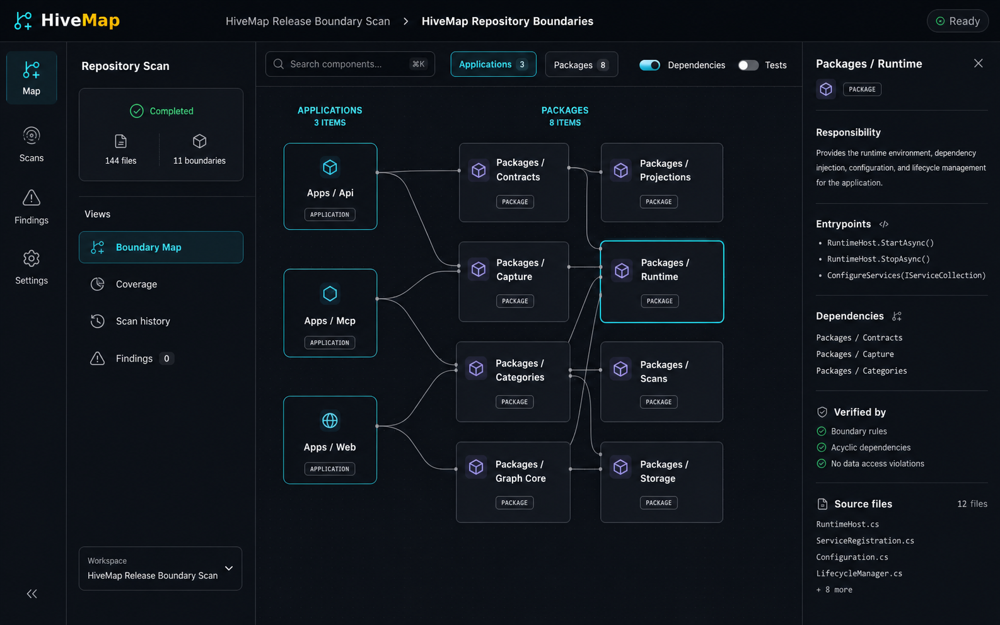

# Verification Evidence

This directory contains bounded review evidence for user-visible behavior that
cannot be established by typechecking alone.

## Ruleset-v2 authentication panel

Captured from the built web application at 1440×1000 after the token lifecycle
change. The panel keeps a password input, explicit Set/Clear actions, and the
visible statement that storage lasts only for the current browser tab.

Interaction behavior is covered by `apps/web/src/AuthTokenPanel.test.tsx`,
`apps/web/src/api.test.ts`, and `apps/web/src/main.test.tsx`: save writes
`sessionStorage`, authenticated requests attach the bearer header, and clear
removes both stored and server-provided visible state without issuing an
unauthenticated refresh.

## Repository boundary workspace redesign target

The accepted 1600×1000 redesign target replaces the long default sidebar with
a fixed primary rail, bounded scan context, horizontal boundary map, and right
inspector. Illustrative labels inside the inspector are not product evidence;
the implementation must render actual workspace, graph, scan, and source-ref
state. The acceptance contract is owned by `docs/specs/web-workspace-ui.md`.
The deployed-browser result is recorded in
`repository-boundary-ui-redesign-acceptance.md`.
